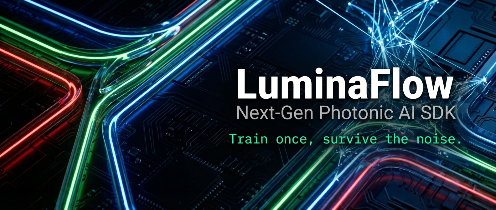

<div align="center">



# 🌊 LuminaFlow

**The PyTorch Interface for Next-Gen Photonic Computing**

[](https://pypi.org/project/luminaflow/)
[](https://opensource.org/licenses/Apache-2.0)
[](https://github.com/luminacore)
[](https://luminacore.ai)

> **"Train once, survive the noise. Build for the speed of light."**

[**Documentation**] | [**White Paper**] | [**Join Discord**]

</div>

---

## 🚀 The Mission

**Moore's Law is hitting the wall. Physics is the way out.**

LuminaFlow is the world's first open-source SDK designed specifically for the **LuminaCore™ Heterogeneous Photonic Architecture**. It enables developers to simulate, train, and deploy neural networks for future photonic chips using standard PyTorch workflows.

We are building a future where **Edge AI** runs on **milliwatt-scale power** using light instead of electricity. But analog optical computing comes with a price: **Noise**.

LuminaFlow solves this. By implementing **Noise-Aware Training (NAT)**, it allows you to train robust "immune" models that maintain **98% accuracy** even under the **15% optical noise** and **4-bit quantization** conditions typical of nanophotonic hardware.

## ✨ Key Features

*   **🔮 Physics-First Simulation Kernel**: Accurate simulation of Shot Noise, Thermal Noise, and DAC/ADC quantization effects. Your code runs as if it's inside a silicon waveguide.
*   **🛡️ Auto-NAT (Noise-Aware Training)**: One-line integration to inject hardware-specific noise during backpropagation, forcing the optimizer to find flat, robust minima.
*   **🌈 Spatial-WDM Logic**: Simulates the multi-channel calculation capabilities (Red for Add, Green for Sub) of the LuminaCore RGB emitter array.
*   **🔌 Drop-in PyTorch Support**: Just replace `nn.Linear` with `luminaflow.nn.OpticalLinear`. Zero learning curve.

---

## 📦 Installation

```bash
pip install luminaflow
```

*Requirements: Python 3.8+, PyTorch 1.9+*

---

## ⚡ Quick Start

### 1. "Photonize" Your Model

Replace standard fully connected layers with Lumina's optical layers. You can define the hardware profile (noise level, bit-depth) directly in code.

```python
import torch
import torch.nn as nn
from luminaflow.nn import OpticalLinear

class MyPhotonicNet(nn.Module):
    def __init__(self):
        super().__init__()
        self.feature_extractor = nn.Sequential(
            nn.Conv2d(1, 32, 3),
            nn.ReLU(),
            nn.Flatten()
        )
        # [Magic Happens Here]
        # Simulating a LuminaCore Nano chip: 15% noise, 4-bit DAC
        self.classifier = OpticalLinear(
            in_features=5408, 
            out_features=10, 
            hardware_profile="Lumina_Nano_v1", 
            precision_bits=4
        )

    def forward(self, x):
        x = self.feature_extractor(x)
        x = self.classifier(x)
        return x
```

### 2. Train with Resilience (NAT)

Standard training will fail on analog hardware. LuminaFlow injects dynamic noise during the forward pass of training to harden the model.

```python
# Standard PyTorch loop...
model.train()
for data, target in train_loader:
    optimizer.zero_grad()
    
    # LuminaFlow automatically injects Gaussian noise 
    # based on the hardware profile defined above.
    output = model(data) 
    
    loss = F.nll_loss(output, target)
    loss.backward()
    optimizer.step()
```

### 3. Verify Robustness

Generate a resilience report to see how your model performs under various noise levels compared to a standard electronic model.

```python
from luminaflow.viz import run_robustness_benchmark

run_robustness_benchmark(model, save_path="benchmark_result.png")
```

---

## 🔬 The Science: Why NAT?

Traditional digital chips (GPUs) operate on perfect logic (0 is 0, 1 is 1). Photonic chips operate on **Analog Physics**, which is inherently stochastic.

<p align="center">
  
</p>

As shown above, a standard model (Grey Line) crashes when optical noise exceeds **10.5%**. A model trained with LuminaFlow's NAT (Red Line) maintains high accuracy even up to **25% noise**. This software resilience allows us to manufacture chips using cost-effective, mature process nodes without needing "perfect" yields.

---

## 🗺️ Roadmap & Bounty Program

We are building this community **bottom-up**. We need you.

| Phase | Goal | Status |
| :--- | :--- | :--- |
| **v0.1** | **Alpha SDK:** PyTorch layers & NAT verification | ✅ Live |
| **v0.5** | **WDM Logic:** Simulating RGB wavelength routing | 🚧 In Progress |
| **v1.0** | **Compiler:** Export weights to GDSII/LUT configs | 📅 Q2 2026 |
| **Hardware** | **Prototype Run:** 64x64 Optical Core Tape-out | 📅 Q4 2026 |

### 🏆 Contributors Bounty
We are actively looking for contributors with expertise in:
*   **FDTD Simulation (MEEP/Lumerical)**
*   **Rare-Earth Material Science**
*   **Compiler Design (MLIR/TVM)**

**Reward:** Top contributors will receive **Priority Access** to the first batch of LuminaCore hardware dev kits and cloud API access.

---

## 🤝 Contributing

We believe the future of computing shouldn't be locked inside proprietary data centers. It should be open, accessible, and everywhere.

1.  Fork the repo.
2.  Create your feature branch (`git checkout -b feature/amazing-feature`).
3.  Commit your changes (`git commit -m 'Add amazing feature'`).
4.  Push to the branch (`git push origin feature/amazing-feature`).
5.  Open a Pull Request.

Please read [CONTRIBUTING.md](CONTRIBUTING.md) for details on our code of conduct.

---

## 📄 License

Distributed under the Apache 2.0 License. See `LICENSE` for more information.

<div align="center">
  <br>
  <sub>Built with ❤️ by the LuminaCore Architecture Team.</sub>
</div>
