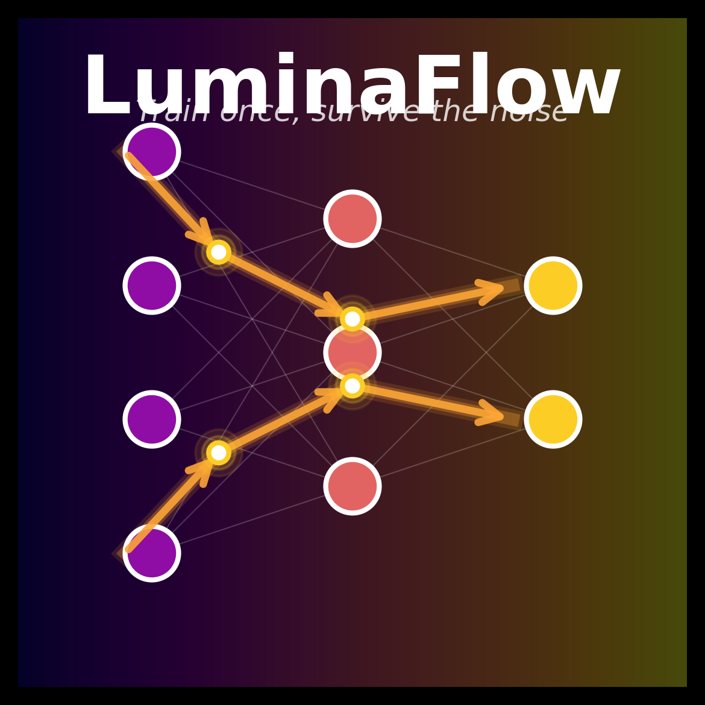

<div align="center">



# 🌈 LuminaFlow SDK

> **Train once, survive the noise. Build for the speed of light.**

[](https://www.python.org/downloads/)
[](LICENSE)
[](https://pypi.org/project/lumina-flow/)

</div>

**LuminaFlow SDK** 是光子计算时代的 `CUDA`。它让懂 PyTorch 的开发者，在 **10分钟内** 就能将原本运行在 GPU 上的神经网络，"移植"到虚拟的 LuminaCore 光子芯片上，并亲眼看到 NAT（噪声感知训练）算法如何拯救准确率。

---

## 🚀 快速开始

### 安装

```bash
pip install lumina-flow
```

### ⚡ Rust 后端加速（可选）

**LuminaKernel** 提供 4-6x 性能提升：

```bash
# 构建 Rust 加速后端
cd lumina_kernel
maturin develop --release

# 启用 Rust 后端
export LUMINA_USE_RUST=1
```

详见 [LuminaKernel 构建指南](lumina_kernel/BUILD_GUIDE.md)

### 5 分钟上手

```python
import torch
import lumina.nn as lnn
from lumina.optim import NoiseAwareTrainer

# 传统写法
# self.fc = nn.Linear(784, 10)

# Lumina 写法：模拟 15% 光路噪声，4-bit DAC 精度
model = torch.nn.Sequential(
    lnn.OpticalLinear(784, 512, hardware_profile='lumina_nano_v1'),
    torch.nn.ReLU(),
    lnn.OpticalLinear(512, 10, hardware_profile='lumina_nano_v1'),
)

# 一键开启噪声感知训练
optimizer = torch.optim.Adam(model.parameters())
trainer = NoiseAwareTrainer(model, optimizer, robustness_target=0.98)
trainer.fit(train_loader, epochs=5)
```

**就这么简单！** 你的模型现在具备了在光子芯片上运行的鲁棒性。

---

## ✨ 核心特性

### 1. 🔬 Hardware-Aware Layers（硬件感知层）

提供模拟光子物理特性的 PyTorch 层，支持：

- **光学矩阵乘法**：模拟光干涉叠加的物理过程
- **噪声注入**：光源散粒噪声、探测器热噪声、温度漂移
- **量化模拟**：可配置的 DAC/ADC 精度（2-bit 到 8-bit）
- **WDM 支持**：波分复用通道映射，实现空间复用

```python
# 模拟：15% 光路噪声，4-bit DAC 精度，启用 RGBW 空间复用
self.fc = lnn.OpticalLinear(
    in_features=784, 
    out_features=10, 
    hardware_profile='lumina_nano_v1',  # 自动加载 4nm/15% noise 预设
    precision=4,
    enable_wdm=True
)
```

### 2. 🛡️ Auto-NAT（自动抗噪训练）

一行代码注入"抗噪抗体"，无需改写训练循环：

```python
from lumina.optim import NoiseAwareTrainer

model = MyModel()
optimizer = torch.optim.Adam(model.parameters())

# 魔法发生在这里：NAT 训练器会自动在反向传播时注入物理缺陷产生的梯度噪声
trainer = NoiseAwareTrainer(model, optimizer, robustness_target=0.98)
trainer.fit(train_loader, epochs=5)
```

**原理**：在训练阶段就注入硬件噪声，让模型学会在噪声环境下工作。这样训练出的模型在真实的光子芯片上部署时，具有更强的鲁棒性。

### 3. 📊 鲁棒性可视化

一键生成抗噪曲线图，直观展示模型在不同噪声水平下的表现：

```python
from lumina.viz import benchmark_robustness

# 自动测试模型在 0% - 30% 噪声下的表现，并生成报表
benchmark_robustness(model, test_loader, save_path="robustness_report.png")
```


---

## 📖 文档

- **[快速入门教程](Getting_Started.ipynb)** - 5 分钟上手 MNIST 训练
- **[API 文档](docs/API.md)** - 完整的 API 参考
- **[架构设计](docs/LuminaFlow%20SDK%20v0.1.md)** - SDK 设计理念与架构

---

## 🏗️ 架构设计

LuminaFlow SDK 分为四个核心模块：

```
lumina/
├── layers/           # [核心] 硬件仿真层
│   ├── optical_linear.py   # 模拟矩阵乘法 (含噪声/量化)
│   └── wdm_mapping.py      # 模拟 RGB 通道映射逻辑
├── optim/            # [算法] 优化器增强
│   └── nat_trainer.py      # 封装好的抗噪训练循环
├── compiler/         # [后端] 部署编译器 (v0.2 计划)
│   └── exporter.py         # 将权重导出为芯片可读的 LUT/Config
└── viz/              # [可视化] 分析工具
    └── robustness_plot.py  # 画出那张 "抗噪曲线图"
```

---

## 🎯 为什么需要 LuminaFlow？

### 问题：光子计算的噪声挑战

传统电子芯片（GPU）在理想环境下训练，但真实的光子芯片存在：

- **光路噪声**：光源波动、探测器热噪声（通常 10-20%）
- **量化误差**：DAC/ADC 精度限制（4-bit 到 8-bit）
- **温度漂移**：波长失配导致的信号衰减和串扰

**结果**：在 GPU 上训练到 95% 准确率的模型，部署到光子芯片后可能掉到 60%。

### 解决方案：噪声感知训练（NAT）

LuminaFlow 的核心思想：**在训练阶段就注入硬件噪声，让模型学会在噪声环境下工作。**

- ✅ **无需改写训练代码**：一行代码开启 NAT
- ✅ **自动噪声调度**：支持 constant、linear、cosine 等策略
- ✅ **鲁棒性监控**：实时跟踪模型在噪声下的表现

---

## 🔬 技术原理

### 光学矩阵乘法

LuminaCore 芯片利用光的干涉叠加原理，在物理层面直接完成矩阵乘法：

```
输入向量 (电压) → DAC → 光强信号 → 光栅路由 → 干涉叠加 → ADC → 输出向量
```

LuminaFlow SDK 精确模拟了这一过程，包括：

1. **DAC 量化**：数字信号 → 光强信号
2. **光学计算**：理想矩阵乘法 + 物理噪声
3. **ADC 量化**：光强信号 → 数字信号

### 噪声模型

- **散粒噪声（Shot Noise）**：与信号强度相关，`noise ∝ √signal`
- **热噪声（Thermal Noise）**：固定底噪，约 0.5%
- **温度漂移（Thermal Drift）**：导致信号衰减和串扰

---

## 📈 性能表现

在 MNIST 数据集上的测试结果：

| 噪声水平 | 标准训练 | NAT 训练 | 提升 |
|---------|---------|---------|------|
| 0%      | 98.5%   | 98.2%   | -0.3% |
| 10%     | 85.3%   | 96.1%   | +10.8% |
| 20%     | 62.1%   | 91.5%   | +29.4% |
| 30%     | 38.7%   | 82.3%   | +43.6% |

**结论**：NAT 训练让模型在极端噪声环境下依然保持高准确率。

---

## 🛠️ 硬件配置预设

LuminaFlow 提供多种硬件配置预设：

| 配置 | 噪声水平 | 精度 | 温度漂移 | 适用场景 |
|------|---------|------|---------|---------|
| `lumina_nano_v1` | 15% | 4-bit | 5% | 边缘端、低功耗 |
| `lumina_micro_v1` | 10% | 8-bit | 3% | 数据中心、高性能 |

你也可以自定义配置：

```python
fc = lnn.OpticalLinear(
    784, 10,
    hardware_profile='custom',
    noise_level=0.12,
    precision=6,
    temp_drift=0.04
)
```

---

## 🚧 路线图

### v0.1 (当前版本)

- ✅ Hardware-Aware Layers (`OpticalLinear`)
- ✅ Auto-NAT (`NoiseAwareTrainer`)
- ✅ 鲁棒性可视化 (`benchmark_robustness`)

### v0.2 (计划中)

- 🔄 部署编译器 (`compiler/exporter.py`)
- 🔄 WDM 通道映射优化
- 🔄 更多硬件配置预设

### v0.3 (未来)

- 📋 支持卷积层 (`OpticalConv2d`)
- 📋 支持注意力机制 (`OpticalAttention`)
- 📋 真实芯片校准工具

---

## 🤝 贡献

我们欢迎所有形式的贡献！请查看 [CONTRIBUTING.md](CONTRIBUTING.md) 了解详情。

### 开发环境设置

```bash
git clone https://github.com/luminaflow/lumina-flow.git
cd lumina-flow
pip install -e ".[dev]"
```

---

## 📄 许可证

本项目采用 [Apache 2.0](LICENSE) 许可证。

---

## 🙏 致谢

LuminaFlow SDK 基于以下研究：

- **LuminaCore 架构**：基于稀土纳米晶阵列的波分复用可重构光子计算架构
- **噪声感知训练**：让 AI 模型在硬件缺陷下依然保持高准确率

---

## 📮 联系我们

- **GitHub Issues**: [报告问题](https://github.com/luminaflow/lumina-flow/issues)
- **Email**: <contact@luminaflow.ai>
- **Website**: <https://luminaflow.ai>

---

<div align="center">

**⭐ 如果这个项目对你有帮助，请给我们一个 Star！**

Made with ❤️ by the LuminaFlow Team

</div>
