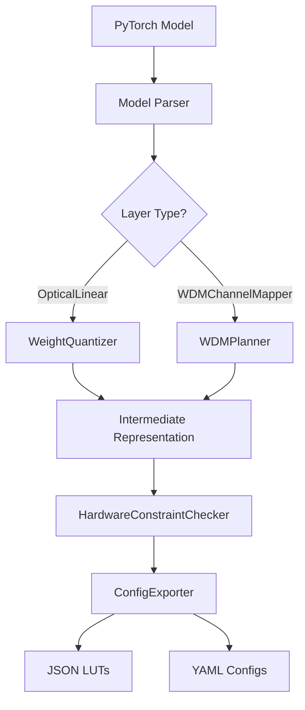

# LuminaFlow v0.3 Compiler Specification

## 1. Overview
The LuminaFlow v0.3 Compiler is designed to bridge the gap between high-level PyTorch models (using `OpticalLinear` layers) and physical photonic hardware. It transforms trained weights and WDM configurations into hardware-readable Look-Up Tables (LUTs) and configuration files.

## 2. Core Components

### 2.1 WeightQuantizer
Responsible for mapping continuous PyTorch weights to discrete hardware states based on the `HardwareConfig` precision.
- **Input**: `torch.Tensor` (Weights)
- **Logic**: Linear or non-linear quantization based on DAC/ADC bit-depth.
- **Output**: Quantized integer states.

### 2.2 WDMPlanner
Maps logical channels to physical wavelengths and manages crosstalk constraints.
- **Input**: `WDMChannelMapper` parameters.
- **Logic**: Calculates wavelength assignments and generates crosstalk compensation matrices.
- **Output**: WDM mapping table.

### 2.3 HardwareConstraintChecker
Validates the model against physical hardware limits (e.g., max power, thermal limits, array size).
- **Input**: Compiled configuration.
- **Logic**: Rule-based validation.
- **Output**: Pass/Fail report with optimization suggestions.

### 2.4 ConfigExporter
Serializes the compiled data into target formats.
- **Formats**: 
  - `JSON`: For weight LUTs and mapping tables.
  - `YAML`: For hardware-specific configurations (noise levels, attenuation).

## 3. Compiler Pipeline



## 4. Interface Design

### 4.1 Model to Compiler API
```python
class LuminaCompiler:
    def __init__(self, hardware_profile: str):
        self.profile = hardware_profile
        
    def compile(self, model: nn.Module) -> CompilationArtifact:
        """
        Translates a PyTorch model into hardware artifacts.
        """
        pass
```

### 4.2 Artifact Structure
- `weights/layer_{id}.json`: Contains the quantized weight matrix.
- `wdm/mapping.json`: Wavelength and channel assignments.
- `device_config.yaml`: Global hardware parameters.

## 5. Hardware Specifics
- **Precision**: Supports 2-bit to 12-bit quantization.
- **WDM**: Supports up to 16 channels with crosstalk modeling.
- **Thermal**: Includes temperature drift compensation coefficients in the exported config.
