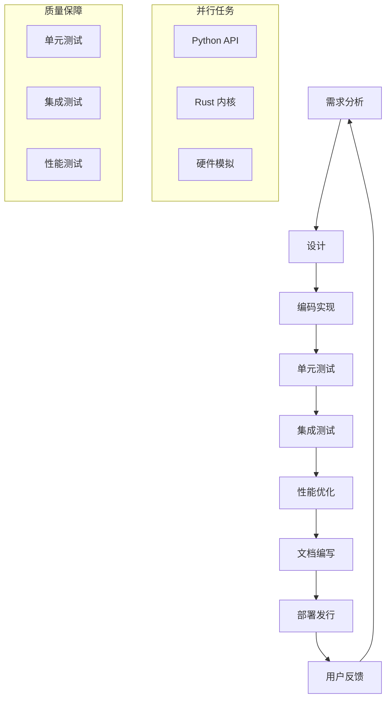
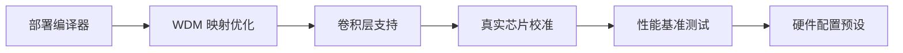

# LuminaFlow 项目任务分解与协调方案

## 1. 项目概述

**LuminaFlow** 是一个基于光子计算的 AI 加速 SDK，提供 PyTorch 原生支持的光子计算模拟和加速能力。项目目标是实现光子计算时代的 CUDA，让开发者能够在传统硬件上模拟和优化光子计算模型，为未来的光子硬件做好准备。

### 核心技术架构

```
┌─────────────────┐    ┌─────────────────┐    ┌─────────────────┐
│   Python API    │    │  Rust Kernel    │    │ Photonic HW Sim │
│                 │    │                 │    │                 │
│ • PyTorch Compat │◄──►│ • High Perf Comp│◄──►│ • WDM Multiplex │
│ • Auto Diff     │    │ • SIMD Optimized│    │ • Noise Modeling│
│ • Model Convert │    │ • Memory Pool   │    │ • HW Config     │
└─────────────────┘    └─────────────────┘    └─────────────────┘
```

## 2. 预期目标和成果

### 短期目标（v0.3 版本）

- 完成部署编译器实现
- 优化 WDM 通道映射
- 支持更多硬件配置预设
- 完善性能基准测试
- 支持卷积层（OpticalConv2d）
- 开发真实芯片校准工具

### 长期目标（v1.0 版本）

- 实现光子计算硬件的真实部署
- 提供完整的生产级 AI 加速解决方案
- 支持大规模光子计算集群

## 3. 技术约束和要求

### 3.1 软件架构约束

- 必须保持 PyTorch 原生兼容性
- 支持自动微分和梯度计算
- 保持与现有 AI 生态系统的互操作性
- 提供高性能的 Rust 后端加速

### 3.2 硬件模拟约束

- 精确模拟光子计算的物理特性（噪声、量化、温度漂移等）
- 支持多种硬件配置预设（边缘端、数据中心等）
- 实现可扩展的物理模型架构

### 3.3 开发流程约束

- 遵循严格的代码风格规范
- 保持高质量的测试覆盖
- 提供完整的文档和示例
- 支持 CI/CD 自动化流程

## 4. 任务分解方案

### 4.1 核心组件开发

#### 任务组 A：Python API 层

- [ ] A-1: 优化 OpticalLinear 层的接口和可扩展性
- [ ] A-2: 实现 OpticalConv2d 卷积层
- [ ] A-3: 增强 OpticalAttention 和 TransformerBlock
- [ ] A-4: 开发部署编译器（compiler/exporter.py）
- [ ] A-5: 优化 WDM 通道映射算法

#### 任务组 B：Rust 内核层

- [ ] B-1: 优化现有的光学线性层融合算子
- [ ] B-2: 实现卷积层的 Rust 加速版本
- [ ] B-3: 优化内存管理和 SIMD 指令使用
- [ ] B-4: 改进 Rust-Python FFI 接口

#### 任务组 C：硬件模拟层

- [ ] C-1: 完善噪声模型（增加新的噪声类型）
- [ ] C-2: 优化温度漂移和衰减模型
- [ ] C-3: 开发真实芯片校准工具
- [ ] C-4: 实现更精细的 WDM 模拟

#### 任务组 D：优化和训练

- [ ] D-1: 改进 NoiseAwareTrainer 的鲁棒性
- [ ] D-2: 开发新的训练策略
- [ ] D-3: 实现硬件感知的优化算法

### 4.2 测试和验证

#### 任务组 E：测试框架

- [ ] E-1: 完善现有测试套件
- [ ] E-2: 开发性能基准测试框架
- [ ] E-3: 实现硬件模拟的验证测试
- [ ] E-4: 增加边界条件和异常处理测试

#### 任务组 F：文档和示例

- [ ] F-1: 编写详细的 API 文档
- [ ] F-2: 创建教程和示例代码
- [ ] F-3: 更新项目 README 和技术文档
- [ ] F-4: 制作演示和可视化示例

### 4.3 系统集成

#### 任务组 G：前端和可视化

- [ ] G-1: 完善 React 前端界面
- [ ] G-2: 增强系统可视化功能
- [ ] G-3: 实现实时硬件状态监控
- [ ] G-4: 开发纳米显微镜模态功能

#### 任务组 H：部署和发行

- [ ] H-1: 完善 CI/CD 流程
- [ ] H-2: 准备 PyPI 发布
- [ ] H-3: 测试 Docker 容器化部署
- [ ] H-4: 优化安装和配置流程

## 5. 专业领域和技能要求

### 5.1 核心开发团队

- **光学物理专家**: 负责物理模型设计和噪声模型优化
- **编译器工程师**: 开发部署编译器和优化器
- **机器学习研究员**: 改进训练策略和模型架构
- **Rust 开发工程师**: 优化内核性能和内存管理
- **Python 开发工程师**: 维护 PyTorch 接口和 API
- **前端开发工程师**: 实现可视化和用户界面

### 5.2 辅助团队

- **测试工程师**: 完善测试套件和验证流程
- **文档工程师**: 编写教程和 API 文档
- **DevOps 工程师**: 管理 CI/CD 和部署流程
- **UX/UI 设计师**: 优化用户体验和界面设计

## 6. 协调工作流程

### 6.1 开发流程架构



### 6.2 协作方式

- **每日站立会议**: 同步任务进度和问题
- **每周迭代计划**: 规划下一周的任务分配
- **代码审查**: 所有代码变更都需要经过至少一次审查
- **文档驱动开发**: 需求和设计文档优先于代码实现
- **自动化测试**: 持续集成和自动化回归测试

### 6.3 工具链

- **版本控制**: Git + GitHub
- **CI/CD**: GitHub Actions
- **项目管理**: GitHub Projects + Issues
- **通信**: Discord + Email
- **代码质量**: pre-commit + 自动格式化

## 7. 任务完成顺序和依赖关系

### 7.1 优先级分类

- **P0（必须完成）**: 核心功能和性能优化
- **P1（重要）**: 测试覆盖和文档完善
- **P2（次要）**: 增强功能和用户体验
- **P3（可选）**: 优化和未来功能

### 7.2 关键路径任务



### 7.3 任务依赖关系

#### 部署编译器（compiler/exporter.py）

- 依赖: 核心层接口稳定
- 前置条件: OpticalLinear、OpticalAttention 接口冻结
- 输出: 模型转换和部署工具

#### 卷积层支持（OpticalConv2d）

- 依赖: Rust 内核基础架构
- 前置条件: 线性层融合算子优化完成
- 输出: 光子卷积层实现

#### 真实芯片校准工具

- 依赖: 物理模型准确性
- 前置条件: 噪声和温度模型优化完成
- 输出: 硬件校准和验证工具

#### 性能基准测试框架

- 依赖: 所有核心组件完成
- 前置条件: 卷积层和训练器优化完成
- 输出: 性能测试报告和对比数据

## 8. 资源分配和时间表

### 8.1 资源分配

- **核心团队**: 3-5 名全职开发工程师
- **物理顾问**: 1-2 名光学物理专家
- **测试团队**: 1-2 名测试工程师
- **文档团队**: 1 名技术文档工程师

### 8.2 阶段时间表

#### 阶段 1: 基础架构优化（2-3 周）

- 完成: 部署编译器、WDM 映射优化
- 主要任务: 架构重构和接口优化

#### 阶段 2: 新功能开发（3-4 周）

- 完成: 卷积层支持、真实芯片校准
- 主要任务: 新功能实现和集成

#### 阶段 3: 测试和优化（2-3 周）

- 完成: 性能基准测试、硬件配置预设
- 主要任务: 性能优化和测试覆盖

#### 阶段 4: 部署和发行（1-2 周）

- 完成: 版本发布和文档完善
- 主要任务: 打包、测试和文档最终版

## 9. 风险评估和应对策略

### 9.1 技术风险

- **物理模型准确性**: 与真实硬件差异可能影响效果
- **性能优化瓶颈**: 可能存在未预期的性能限制
- **API 稳定性**: 接口变更可能影响用户代码

### 9.2 应对策略

- 建立硬件验证测试框架
- 定期进行性能基准测试
- 维护详细的变更日志和迁移指南

### 9.3 项目管理风险

- **任务依赖**: 关键路径任务延迟可能影响整体进度
- **资源分配**: 核心团队可能面临资源紧张

### 9.4 应对策略

- 优先处理关键路径任务
- 建立备用资源分配方案
- 定期评估和调整时间表

## 10. 成功标准

### 10.1 功能完整性

- 所有计划的功能都已实现
- 支持卷积层和真实芯片校准
- 部署编译器正常工作

### 10.2 性能指标

- 与传统 GPU 相比有显著的能源效率提升
- 训练和推理性能满足预期
- 内存使用和延迟优化到位

### 10.3 质量标准

- 测试覆盖率达到 80% 以上
- 代码通过所有质量检查
- 文档完整且易于理解

### 10.4 用户体验

- 安装和配置过程简单
- 文档和示例完整
- 社区支持到位

## 11. 总结

LuminaFlow 项目是一个创新性的光子计算模拟和加速框架，旨在为未来的光子计算硬件做好准备。通过合理的任务分解和协调工作流程，我们将能够高效地实现项目目标，为开发者提供强大的光子计算能力。

项目的成功将依赖于:

1. 跨专业团队的密切协作
2. 严格的质量控制和测试流程
3. 持续的性能优化和技术改进
4. 积极的用户反馈和社区参与

我们有信心在预定的时间表内完成项目，并提供高质量的产品。
